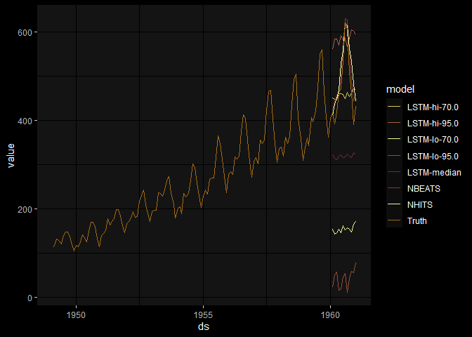
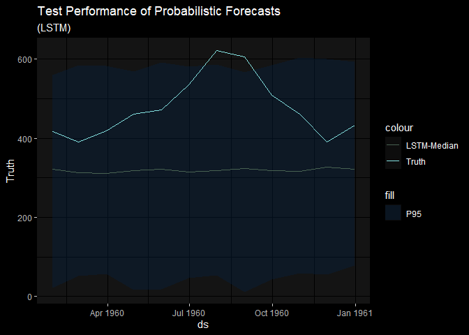

# nixtla’s neuralforecast via R

Below sources helper functions for creating deep learning predictions in
R. (If you are interested in how these functions were created review the
*nixtla_r_tutorial*.)

``` r
library(dplyr)
```


    Attaching package: 'dplyr'

    The following objects are masked from 'package:stats':

        filter, lag

    The following objects are masked from 'package:base':

        intersect, setdiff, setequal, union

``` r
library(tidyr)
library(ggplot2)
library(BobRossColors)

source("nixtla_fcns.R")

airpassengers_df <- data.table::fread("airpassengersDF.csv")
```

Now that we have the required functions and data, we are going to split
our data into training and test for benchmarking performance:

``` r
train_df <- airpassengers_df |> 
              dplyr::filter(ds<='1959-12-31') # 132 train

test_df  <- airpassengers_df |>
             dplyr::filter(ds>'1959-12-31') # 12 test
```

#### Model Parameters

model setup below following the python examples:

``` r
horizon <- length(test_df$ds)
input_size <- as.integer(2*horizon)

  levels <- c(70, 95)
  
# model parameterization  
  models <- c(NBEATS(input_size= input_size, h=horizon, max_steps=50),
               NHITS(input_size= input_size, h=horizon, max_steps=50),
                LSTM(input_size= input_size, h=horizon, max_steps=40,
                     loss=MQLoss(level=levels)))
```

#### Model Setup, Fitting, and Predictions

model training and predictions is handled below we our custom functions
making it easy to work with our python imports:

``` r
  # stage models
nf_set <- neural_model_setup(models = models, frequency = "M")  

  # fit models   
nf_fit <- neural_model_fit(model_setup = nf_set, df = train_df)

 # make predictions
nf_preds <- neural_model_predict(model_setup = nf_set, model_fit = nf_fit)
```

#### exploratory analysis of models vs. actuals

all data:

``` r
airpassengers_df |> 
  rename("Truth" = "y") |> 
  left_join(nf_preds, by = "ds") |>
  pivot_longer(-c(ds, unique_id), names_to = "model", values_to = "value") |>
  ggplot() + 
  geom_line(aes(x = ds, y = value, color = model)) + 
  theme_minimal() + 
  ggdark::dark_mode() + 
  BobRossColors::scale_color_bob_ross(painting = "a_walk_in_the_woods", type = "qualitative") +
  labs("Air Passenger Predictions from Nixtla in R")
```

    Inverted geom defaults of fill and color/colour.
    To change them back, use invert_geom_defaults().

    Warning: Removed 924 rows containing missing values (`geom_line()`).



test dataset and point forecasts:

``` r
test_df |> 
  rename("Truth" = "y") |> 
  left_join(nf_preds |> select(ds, NBEATS, NHITS), by = "ds") |>
  pivot_longer(-c(ds, unique_id), names_to = "model", values_to = "value") |>
  ggplot() + 
  geom_line(aes(x = ds, y = value, color = model)) + 
  theme_minimal() + 
  ggdark::dark_mode() + 
  BobRossColors::scale_color_bob_ross(painting = "balmy_beach", type = "qualitative") +
  labs(title = "Test Performance of Point Forecasts",
       subtitle = "(NHITS & NBEATS)")
```


test dataset and probabilistic performance:

``` r
test_df |> 
  rename("Truth" = "y") |> 
  left_join(nf_preds |> select(ds, starts_with("LSTM")), by = "ds") |>
  ggplot() + 
  geom_ribbon(aes(x = ds, ymin = `LSTM-lo-95.0`, ymax = `LSTM-hi-95.0`, fill = "P95"), alpha = .4) + 
  geom_line(aes(x = ds, y = Truth, color = "Truth")) + 
  geom_line(aes(x = ds, y = `LSTM-median`, color = "LSTM-Median")) +
  theme_minimal() + 
  ggdark::dark_mode() + 
  labs(title = "Test Performance of Probabilistic Forecasts",
       subtitle = "(LSTM)") + 
  scale_color_bob_ross(painting = "forest_river", type = "qualitative") + 
  scale_fill_bob_ross(painting = "wilderness_trail")
```


