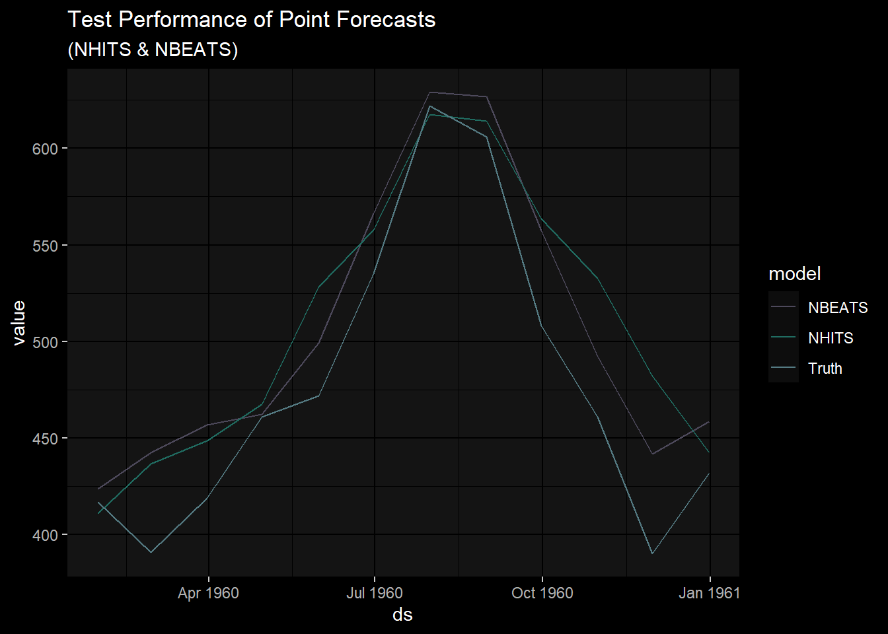

# nixtla-r-tutorial
fth

#### notes:

Below, is documentation on bridging nixtla to r, using reticulate. This
will eventually be a package of its own. But in essence, this is a guide
to setting up python, nixtla, and R, so that one can train n-beats &
n-hits, two newly developed SOTA deep learning models from R.

#### setup code chunk:

you will need a recent version of reticulate, miniconda, and python.
Uncomment code where necessary:

``` r
library(reticulate)

# reticulate::install_miniconda(force=TRUE)
# reticulate::install_python()
# py_install("neuralforecast", pip = TRUE) 
```

import python modules & submodules into R envs:

``` r
# forecasting tool
NeuralForecast <- py_run_string("from neuralforecast import NeuralForecast")

# models we want
# NBEATS <- py_run_string("from neuralforecast.models import NBEATS")
# NHITS  <- py_run_string("from neuralforecast.models import NHITS")

nf <- reticulate::import("neuralforecast") # importing entire module instead of subs for models

# test dataset 
AirPassengersDF <- py_run_string("from neuralforecast.utils import AirPassengersDF")
```

``` r
library(dplyr)
```


    Attaching package: 'dplyr'

    The following objects are masked from 'package:stats':

        filter, lag

    The following objects are masked from 'package:base':

        intersect, setdiff, setequal, union

``` r
# Split data and declare panel dataset
Y_df = AirPassengersDF$AirPassengersDF
Y_train_df = Y_df |> 
              dplyr::filter(ds<='1959-12-31') # 132 train

Y_test_df = Y_df |>
             dplyr::filter(ds>'1959-12-31') # 12 test
```

#### model setup:

note that \[\] brackets are now c() and the input_size must be forced
into an integer value:

``` r
# Fit and predict with NBEATS and NHITS models
horizon <- length(Y_test_df$ds)

models <- c(nf$models$NBEATS(input_size=as.integer(2 * horizon), h=horizon, max_steps=50),
             nf$models$NHITS(input_size=as.integer(2 * horizon), h=horizon, max_steps=50))
```

#### fit and predict:

``` r
# using the py envs models until I have a fix.
neural_setup <- NeuralForecast$NeuralForecast(models=models, freq='M')

neural_fit <- neural_setup$fit(df=Y_train_df)

neural_cast <- neural_setup$predict(neural_fit)
```

#### eda:

``` r
library(ggplot2)
# devtools::install_github("frankiethull/BobRossColors")
library(BobRossColors)

Y_df |>
  left_join(neural_cast, by = "ds") |>
  ggplot() + 
  geom_line(aes(x = ds, y = y, color = "truth"), size = 1.4) + 
  geom_line(aes(x = ds, y = NBEATS, color = "NBEATS"), size = 1.4) + 
  geom_line(aes(x = ds, y= NHITS, color = "NHITS"), size = 1.4) + 
  theme_minimal() + 
  BobRossColors::scale_color_bob_ross() + 
  labs(title = "Air Passenger Predictions from Nixtla in R")
```



``` r
sessionInfo()
```

    R version 4.3.0 (2023-04-21 ucrt)
    Platform: x86_64-w64-mingw32/x64 (64-bit)
    Running under: Windows 10 x64 (build 19044)

    Matrix products: default


    locale:
    [1] LC_COLLATE=English_United States.utf8 
    [2] LC_CTYPE=English_United States.utf8   
    [3] LC_MONETARY=English_United States.utf8
    [4] LC_NUMERIC=C                          
    [5] LC_TIME=English_United States.utf8    

    time zone: America/Los_Angeles
    tzcode source: internal

    attached base packages:
    [1] stats     graphics  grDevices utils     datasets  methods   base     

    other attached packages:
    [1] BobRossColors_0.0.0.9000 ggplot2_3.4.2            dplyr_1.1.2             
    [4] reticulate_1.30         

    loaded via a namespace (and not attached):
     [1] Matrix_1.5-4     gtable_0.3.3     jsonlite_1.8.5   compiler_4.3.0  
     [5] tidyselect_1.2.0 Rcpp_1.0.10      tidyr_1.3.0      scales_1.2.1    
     [9] png_0.1-8        yaml_2.3.7       fastmap_1.1.1    lattice_0.21-8  
    [13] here_1.0.1       R6_2.5.1         labeling_0.4.2   generics_0.1.3  
    [17] knitr_1.43       tibble_3.2.1     munsell_0.5.0    rprojroot_2.0.3 
    [21] pillar_1.9.0     rlang_1.1.1      utf8_1.2.3       xfun_0.39       
    [25] cli_3.6.1        withr_2.5.0      magrittr_2.0.3   digest_0.6.31   
    [29] grid_4.3.0       rstudioapi_0.14  rappdirs_0.3.3   lifecycle_1.0.3 
    [33] vctrs_0.6.2      evaluate_0.21    glue_1.6.2       farver_2.1.1    
    [37] fansi_1.0.4      colorspace_2.1-0 purrr_1.0.1      rmarkdown_2.22  
    [41] tools_4.3.0      pkgconfig_2.0.3  htmltools_0.5.5 
